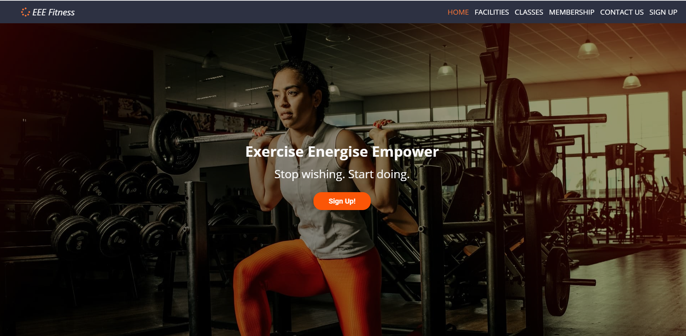

<h1 align="center"><a href="https://github.com/nualagr/eeefitness" style="text-decoration: none; color: #2D3142; font-weight: bold">EEE Fitness</a></h1>

<h2 align="center">Code Institute - Milestone Project 1</h2>

*Created using* [Am I Responsive](http://ami.responsivedesign.is/)

EEE Fitness is a fictitious gym whose motto is Exercise Energize Empower. 
This project is the first of four Milestone Projects that make up the Full Stack Web Development Program at the [Code Institue](https://codeinstitute.net/). 
The main requirements were to make a static but responsive website with a minimum of three pages using HTML5 and CSS3.

Click <a href="https://nualagr.github.io/eeefitness/">here</a> view the website live.
 

## **Table of Contents**
1. [**User Experience (UX)**](#user-experience)
    - [User Stories](#user-stories)
        - [New User](#new-user)
        - [Returning User](#returning-user)
        - [Business Owner](#business-owner)
2. [**User Centered Design**](#user-centered-design)
    - [1) The Strategy Plane](#1-strategy-plane)
    - [2) The Scope Plane](#2-scope-plane)
    - [3) The Structure Plane](#3-structure-plane)
    - [4) The Skeleton Plane](#4-skeleton-plane)
        - [Wireframes](#wireframes)
        - [Features](#features)
    - [5) The Surface Plane](#5-surface-plane) 
        - [Design](#design)
        - [Colour Scheme](#colour-scheme)
        - [Icons](#icons)
        - [Typography](#typography)
3. [**Development**](#development)
    - [Existing Features](#existing-features)
    - [Future Features](#future-features)
4. [**Technologies Used**](#technologies-used)
5. [**Testing**](#testing)
    - [Performance](#performance)
    - [HTML Validation](#html-validation)
    - [CSS Validation](#css-validation)
    - [Manual Testing](#manual-testing)
    - [Responsiveness](#responsiveness)
    - [Tested User Stories](#tested-user-stories)
    - [Bugs](#bugs)
6. [**Deployment**](#deployment)
7. [**Credits**](#credits)
    - [Content](#content)
    - [Media](#media)
    - [Acknowledgements](#acknowledgements)
    - [References](#references)

 

---
## User Experience
This section provides insight into the UX process, focusing on who the EEE Fitness website is for, the main aims of the project and 
how the website can help users meet their needs.

Project goals:
- To encourage users to sign up to become gym members
- To encourage users to enquire about becoming a gym member
- To facilitate those who wish to contact EEE Fitness
- To present users with information about the EEE Fitness gym so that they understand what facilities and services are available there, 
  where it is located, its opening hours, its membership packages and their respective prices.
- To create a website that is visually appealing, and fully responsive on all devices and screen sizes
- To make EEE Fitness seem a reputable business by creating a professional looking website

 

### User Stories

#### New User
I am a prospective gym member: 
- I need to be convinced as to why I should become a member of this gym. 
- I want to find out about the gym’s ethos.
- I want to find out where the gym is located.
- I want to find out the opening hours.
- I want to find out what gym facilities are available. 
- I want to find out what classes are on offer.
- I want to find out when those classes are run.
- I want to be able to read reviews of the gym written by gym members.
- I want to find out about the personal trainers and their qualifications.
- I want to find out what services are on offer at the gym.
- I want to find out how much membership to the gym will cost.

If I decide that I am interested in joining the gym: 
- I want to be able to contact the gym.
- I want to be able to sign up to become a gym member.

#### Returning User
I am a current gym member:
- I want to view the gym opening hours.
- I want to see what classes are on offer.
- I want to see what times the classes are running.
- I want to be able to book a place in a class.
- I want to be able to contact the gym and make an enquiry.
- I want to be able to leave a gym review.

I am a former gym member:
- I want to view the gym opening hours.
- I want to view the classes on offer.
- I want to see what times the classes are running.
- I want to be able to find out what services are on offer.
- I want to find out about the personal trainers and their qualifications.
- I want to find out how much membership to the gym now costs.
- I want to be able to contact the gym and make an enquiry about whether there is any discount for returning members.

#### Business Owner
I am the owner of EEE Fitness: 
- I want to encourage more people to sign up to the gym.
- I want to clearly display information about the gym in an attractive and informative way for both current and prospective members.
- I want visitors to the site to be able to contact the gym easily.
- I want prospective clients to be able to sign up easily.
- I want to encourage more visitors to follow the gym on social media and thereby raise the profile of the gym.
- I want to showcase positive reviews that the gym has received.

 

##### back to [top](#table-of-contents)
---

## User Centered Design
### 1 Strategy Plane
The User Centered Design process started with the creation of the User Stories.  These influenced subsequent feature, layout and design decisions.

The main business goal of the website is to attract new members to the gym or to encourage them to enquire about becoming members. 
The website follows the Business to Consumer model and is aimed at a fitness conscious audience. 
The site has been designed to provide minimal, but relevant, content that is easy to access, which satisfies the needs of both the business and its consumers. 
Imagery of fit individuals working out have been used extensively throughout the site in order to showcase the results that gym members can aspire to achieve.
Imagery of a wide variety of exercise equipment has been used in order to showcase the gym's facilities.

 

### 2 Scope Plane
The key features of the website were developed based on the user needs. 

Users should be able to do the following on the website:
- Sign up to become a gym member
- Find out information about the gym’s: 
  * location
  * opening times
  * price plans
  * services
  * facilities
  * classes
  * class timetable 
- Learn about the benefits of becoming a member
  * membership packages
  * gym-member reviews
- Contact the gym with a question
- Visit the gym’s social media channels
- Learn more about the gym and its ethos

 

### 3 Structure Plane

After identifying the needs of the site's users and after visiting many gym websites the following website features were chosen

  *  table displaying opening times
  *  gym postal address
  *  map showing the gym's location
  *  gym telephone number
  *  gym social media links
  *  Contact Us form
  *  sign Up form
  *  hero images
  *  gym logo
  *  gym membership packages and pricing information section
  *  gym services information section
  *  gym facilites information section
  *  gym classes information section
  *  gym staff information section
  *  gym-member reviews

For ease of navigation it was decided to opt for a multi-page site, grouped into four pages: ‘Home’, ‘About, ‘Membership’ and ‘Contact’. 

 

### 4 Skeleton Plane

The UI wireframing tool, [Balsamiq](https://balsamiq.com/), was used to create wireframes for each site page as it would appear on desktop, tablet and mobile devices.

The main content areas were expressed in similar ways to create consistency across the site as a whole.  

A ‘hero image’, title and motivational heading was included at the top of each page.

In order to help users navigate through the site efficently a fixed navbar was decided upon for desktop viewers. 
The smaller, neater 'hamburger' icon with accompanying dropdown menu was chosen to provide mobile and tablet users with a less cluttered screen and therefore, a more pleasant browsing experience.
 
A footer, which contains the most sought after information: the site address, email address, telephone number, opening hours and social media links, was included at the bottom of every page.

#### Wireframes

##### Desktop
- [Home page for Desktop](https://github.com/nualagr/eeefitness/blob/master/documentation/wireframe/desktop-home.png)

- [Facilities page for Desktop](https://github.com/nualagr/eeefitness/blob/master/documentation/wireframe/desktop-facilities.png)

- [Classes page for Desktop](https://github.com/nualagr/eeefitness/blob/master/documentation/wireframe/desktop-classes.png)

- [Membership page for Desktop](https://github.com/nualagr/eeefitness/blob/master/documentation/wireframe/desktop-membership.png)

- [Contact Us page for Desktop](https://github.com/nualagr/eeefitness/blob/master/documentation/wireframe/desktop-contact.png)

##### Tablet
- [Home page for Tablet](https://github.com/nualagr/eeefitness/blob/master/documentation/wireframe/tablet-home.png)

- [Facilities page for Tablet](https://github.com/nualagr/eeefitness/blob/master/documentation/wireframe/tablet-facilities.png)

- [Classes page for Tablet](https://github.com/nualagr/eeefitness/blob/master/documentation/wireframe/tablet-classes.png)

- [Membership page for Tablet](https://github.com/nualagr/eeefitness/blob/master/documentation/wireframe/tablet-membership.png)

- [Contact Us page for Tablet](https://github.com/nualagr/eeefitness/blob/master/documentation/wireframe/tablet-contact.png)

##### Mobile
- [Home page for Mobile](https://github.com/nualagr/eeefitness/blob/master/documentation/wireframe/mobile-home.png)

- [Facilities page for Mobile](https://github.com/nualagr/eeefitness/blob/master/documentation/wireframe/mobile-facilities.png)

- [Classes page for Mobile](https://github.com/nualagr/eeefitness/blob/master/documentation/wireframe/mobile-classes.png)

- [Membership page for Mobile](https://github.com/nualagr/eeefitness/blob/master/documentation/wireframe/mobile-membership.png)

- [Contact Us page for Mobile](https://github.com/nualagr/eeefitness/blob/master/documentation/wireframe/mobile-contact.png)

 

### 5 Surface Plane

#### Design
According to [statistica.com](https://www.statista.com/outlook/313/140/fitness/ireland#market-age) the highest percentage of gym-going users in Ireland in 2019 were in the 25 to 34 year-old age category. 
This cohort of society are mobile savvy and therefore a mobile-first approach was taken, helped by the use of the [Bootstrap Framework](https://getbootstrap.com/). 
These young professionals have disposable income it can be assumed they are looking for a professional gym that achieves results and provides them with a wide variety of workout options.
People in this age category are likely to be busy, working, commuting, socialising and to have family commitments, therefore time is a 
precious commodity to them. Because of this it is imperative that the site be easy to navigate with key information intuitively located. 

#### Colour Scheme
The colour scheme was chosen in order to convey a simple, clean and visually appealing site that evoked both an energetic, yet clean and professional atmosphere. Orange is colour that is traditionally associated with energy.  
White is a colour associated with cleanliness.  Grey is a colour associated with business and professionalism. 

*Colour palette created at* [coolors.co](https://coolors.co/ffbe0b-fb5607-ff006e-8338ec-3a86ff).

- #2D3142, Space Cadet, a relatively dark, professional-looking grey, was chosen for the navigation bar and the footer. 
As most gym equipment is grey in colour, shades of grey appeared to be appropriate for the functional navigational bar and the footer.
- The background colour of site is #FAFAFA, Cultured, a subtle white colour, to keep the website’s image clean and to provide easy contrast.
- Active links are be displayed in #FC7536, Orange Crayola.  Non-active links change from Cultured to Orange Crayola when hovered over in order to provide visual feedback to the user. 
To be consistent the social media links in the footer behave in a similar fashion.
- #FC7536, Orange Crayola, is used as an accent colour throughout the site, from the logo to providing a striking contrasting background colour, to call-to-action buttons.  Where a stronger contrast was desired #FB5607, Orange Pantone was used in its stead.
- #D3D3D3, Light Grey, was used instead of Cultured in areas where it was deemed that it would produce a softer contrast, for example it was 
used as a muted text colour in the footer and as a background colour for the inactive class timetable tabs. 
- Text colour throughout the site is Cultured, Light Grey or Space Cadet, depending on which proved easier for the user to read against the assigned background colour of the element in question.

#### Icons
Icons were used alongside the text within the site in order to help the user to understand the content at a glance. 
They were taken from [Font Awesome](https://fontawesome.com/) and chosen to be self explanatory.

#### Typography
According to [ilovewp.com](https://www.ilovewp.com/resources/wordpress-for-gyms/most-used-google-fonts-on-gym-websites/)’s article, 'Most Used Google Fonts on Gym Websites' *Open Sans* was the most popular font, 
therefore it was chosen as the main heading font.  [Google Fonts](https://fonts.google.com/) suggested *Roboto* as a complimentary font to *Open Sans*.  As this font was also the third most popular font choice
on gym websites, it was selected as the main font for the body of the website.   

##### back to [top](#table-of-contents)
---

## Development
In Mentor Session 1, Mr. Reuben Ferrante suggested that a more efficient layout for the About page was necessary as the wireframe layout chosen would result in an unpleasant user experience for the mobile user.  Both tab and dashboard layouts were considered before the final layout of separate pages for Services, Facilities and Classes was chosen. 
The About page information relating to the gym staff and services were included on the Home page and the final site structure 
consists of six main pages: Home, Facilities, Classes, Membership, Contact and Sign Up.  This structure should ensure that the end user
has a pleasant and efficient experience as they are able to access the information that they seek with fewer clicks, hopefully leading them to continue their browsing experience.

*Site Map was created using* [Microsoft Word](https://www.microsoft.com/en-ie/microsoft-365/p/word/cfq7ttc0k7c7?=&ef_id=Cj0KCQjwwuD7BRDBARIsAK_5YhXETvfhSIhKaGdssIQw29SJmGZ4uWT6YF9Tfd1-1qMY2mSRD4t5F2oaAo-iEALw_wcB%3aG%3as&OCID=AID2100139_SEM_Cj0KCQjwwuD7BRDBARIsAK_5YhXETvfhSIhKaGdssIQw29SJmGZ4uWT6YF9Tfd1-1qMY2mSRD4t5F2oaAo-iEALw_wcB%3aG%3as&lnkd=Google_O365SMB_App&gclid=Cj0KCQjwwuD7BRDBARIsAK_5YhXETvfhSIhKaGdssIQw29SJmGZ4uWT6YF9Tfd1-1qMY2mSRD4t5F2oaAo-iEALw_wcB&activetab=pivot%3aoverviewtab).

 

## Features

### Existing Features

The project consists of six different pages, all of which can be accessed through the menu in the navigation bar.

#### Consistent features across all pages:

The company's **favicon**, displayed on the web brower's tab, allows the user to identify the website by sight.

The **Title**, displayed on the web browser's tab at all times, clearly identifies the company name, clarifies that it is a gym and states its location.

**Header**

- **Company Logo**: created using [Font Awesome](https://fontawesome.com/) and [Inkscape](https://inkscape.org/).  This allows the user to instantly recognise the companies brand. 
- **Navigation Bar**: allows the user to navigate through the site easily. Fully responsive it condenses to a 'hamburger icon' for a more streamlined appearance on tablet and mobile devices.
 

**Footer**

- **Contact Details**: make it easy for any user to find the gyms location, email address, phone number and opening hours without leaving the page they are on.
  - an **iframe** shows the user the location of the gym (visible on desktop and tablet view only)
  - gym postal address
  - gym **telephone number with active link** so the user can call the gym immediately
  - gym **email address with active link** so that the user can email the gym directly if they have a query
  - table displaying the gym's opening hours so that the user can see at a glance when the gym is open
- **Social Media Links**: allow the user to easily access the gym's fictitious Facebook, Instagram, YouTube and Twitter accounts.

 

#### Features by page

#### index.html features
  - A full-screen **hero image** with 'Sign Up' **call-to-action button** entices the user to sign up immediately upon entering the site.
  - The EEE Fitness Services Section provides the user with a concise description of the services on offer.  **Eye-catching icons** provide them with an understanding of the services at a glance.  **Call-to-action buttons** facilitate the user's curiosity by linking to further information about each service, located elsewhere on the site.  
  - A **carousel** featuring client testimonials and accompanying photographs allows the user to read positive reviews of the gym, its staff and facilities.
  - The Meet the Team section provides the user with **photographs** of the gym's personal trainers, the human face of the company.  Accompanying information showcases the professional and highly-qualified nature of EEE Fitness staff.
  - A striking orange coloured **call-to-action banner** and **call-to-action button** draws the user's eye.  It enables the user to sign-up without having to scroll back up to the top of the page or to click the menu button.

#### facilities.html features
  - A **banner image** with motivational heading reaffirms the gym's brand by referencing part of the gym's motto.
  - **High quality images** of gym members and gym equipment allow the user to see the gym's facilities in an attractive light. 
  Images of both male and female gym members have been chosen in order to appeal to as wide an audience as possible. 
  Short descriptions of the gym's different zones explain succintly what is on offer to the gym's members.

#### classes.html features
  - A **banner image** with motivational heading emphasises part of the gym ethos - that EEE Fitness can make working out fun.
  - A **tabbed navigation pane** allows the user to easily tab, rather than scroll, through the different days of the week in order to see what classes are on offer.
  - **Call-to-action** 'Learn More' buttons have been placed next to each class to quickly bring the user to a class description and accompanying image located further down the page.

#### membership.html features
  - A **banner image** with motivational heading suggests the helpful and personalised service on offer in EEE Fitness.
  - A **card deck** with bullet point statements clearly displays the different membership packages on offer to the user, their components and price.
  - A **call-to-action** 'Sign Up' button allows the user to navigate straight to the Sign Up Form without having to use the navigation bar.

#### contact.html features
  - A **banner image** with rhetorical question and imperative statement encourages the user to take action and contact the gym.
  - A full page **Contact Us Form** allows the user to contact the company without having to open their own email provider's website or app. 
  They are asked to provide their name, email address, phone number and to type their enquiry into a textarea.
  This will enable staff members to greet the user by name and to provide them with a more efficient service when they contact them to follow up on the enquiry.
  - A **call-to-action** 'Submit' button enables the user to send their completed form to the gym.

#### register.html features
  - A **banner image** with motivational statement confirms that the user has taken a positive step towards achieving their fitness goal by opening the Sign Up page.
  - A **Sign-Up Form** enables the user to sign up to become a member of the gym.  
  Users are asked to submit their name, email address, phone number and choose their desired membership package from a drop-down list. This provides the gym staff 
  with vital information about how to contact their new member and what package they wish to purchase. It also enables staff to greet the customer by name 
  when contacting them and it should make the subsequent sign-up procedure smoother for the client.
  - A **Call-to-action** 'Sign Up' button encourages the user to complete the registration process.

 

### Future Features
 - An online payment system so that new users can buy their membership package immediately from the site.
 - An online booking system for classes that current gym members can access through the website.  
 - A link to TrustPilot or a similar consumer review website where the gym’s current members can share their positive experiences at EEE Fitness.

##### back to [top](#table-of-contents)
---

## Technologies Used
- Languages: 

  * [HTML5](http://en.wikipedia.org/wiki/HTML5)
  * [CSS3](http://en.wikipedia.org/wiki/CSS)
  * [JavaScript](https://en.wikipedia.org/wiki/JavaScript). JavaScript was imported from the [Bootstrap Framework](https://getbootstrap.com/) 
  for the responsive navbar used throughout the site, the testimonial carousel on index.html and the tabbed navigation pane used for the class timetable on classes.html.

- Websites
  * [Am I Responsive](http://ami.responsivedesign.is/). Used to create the mock-up image at the top of this document which shows the site as it would behave when viewed on desktop, mobile and tablet devices. 
  * [Bootstrap Framework](https://getbootstrap.com/). Used to structure the website layout and ensure that it was responsive on all devices.
  * [Burst](https://burst.shopify.com). Used to source royalty free images.
  * [Code Institute](https://codeinstitute.net/). Used to review concepts covered in preceding modules and walk-through projects. 
  * [Code Pen](https://codepen.io/careecodes/pen/vGyNxN*/). The code for the shadow-box page divider on the classes.html page was initially sourced from the codepen.io site.
  * [Coolors](https://coolors.co/ffbe0b-fb5607-ff006e-8338ec-3a86ff). Used to choose a colour scheme.
  * [Font Awesome](https://fontawesome.com/). Used to source the free icons that were used in the Services section on index.html, as the social media links in the footer and as the favicon.
  * [Google Chrome Developer Tools](https://developers.google.com/web/tools/chrome-devtools). Used extensively throughout the project to test the responsiveness of elements, to target and apply CSS styles during the design phase and to test the site's performance once built. 
  * [Google Fonts](https://fonts.google.com/). Used to choose and source the fonts used throughout the site.
  * [Github](https://github.com/). Used to host the deployed site and used as a respository for all previous versions of the build.
  * [Gitpod](https://www.gitpod.io/). Online IDE used to build and develop the website.
  * [Optimizilla](https://imagecompressor.com/). Used during the testing phase in order to compress the photographs to reduce the site loading time.
  * [Pexels](www.pexels.com). Used to source royalty free images.
  * [Pixabay](www.pixabay.com). Used to source royalty free images.
  * [Slack](code-institute-room.slack.com). Used during all phases of development and testing to find the answers to questions and the solutions to problems enountered.
  * [Stack Overflow](https://stackoverflow.com/). Used to search for the answers to problems encountered during the development and testing of the website.
  * [Unsplash](www.unsplash.com). Used to source royalty free images.
  * [W3C CSS Validation Service](https://jigsaw.w3.org/css-validator/validator). Used to validate the CSS file.
  * [W3C HTML Validation Service](https://validator.w3.org/#validate_by_uri). Used to validate the HTML files.
  * [W3Schools](https://www.w3schools.com/howto/howto_css_hide_scrollbars.asp). The code to hide the scrollbar but keep the scroll functionality was found on W3Schools.

- Apps:
  * [Balsamiq](https://balsamiq.com/). Used to create the project wireframes.
  * [Inkscape](https://inkscape.org/). Used to edit FontAwesome icons that were used as bullet images and as the Favicon.
  * [Microsoft Word](https://www.microsoft.com/en-ie/microsoft-365/p/word/cfq7ttc0k7c7?=&ef_id=Cj0KCQjwwuD7BRDBARIsAK_5YhXETvfhSIhKaGdssIQw29SJmGZ4uWT6YF9Tfd1-1qMY2mSRD4t5F2oaAo-iEALw_wcB%3aG%3as&OCID=AID2100139_SEM_Cj0KCQjwwuD7BRDBARIsAK_5YhXETvfhSIhKaGdssIQw29SJmGZ4uWT6YF9Tfd1-1qMY2mSRD4t5F2oaAo-iEALw_wcB%3aG%3as&lnkd=Google_O365SMB_App&gclid=Cj0KCQjwwuD7BRDBARIsAK_5YhXETvfhSIhKaGdssIQw29SJmGZ4uWT6YF9Tfd1-1qMY2mSRD4t5F2oaAo-iEALw_wcB&activetab=pivot%3aoverviewtab). Used to create the hierarchical representation of the site layout.

##### back to [top](#table-of-contents)
---

## Testing

[Google Chrome Developer Tools](https://developers.google.com/web/tools/chrome-devtools) were used extensively throughout the development process in order to test whether elements were responsive when viewed on mobile and tablet devices. When problems were encountered the Device Selector was used to target the element.  Using the Elements Panel in Developer Tools the code in question was altered in order to achieve the desired result. 
Working code snippets were then replicated in the style.css file in [Gitpod](https://www.gitpod.io/). Other solutions for errors were found in the Code Institute [Slack](code-institute-room.slack.com) channels, on [Stack Overflow](https://stackoverflow.com/), on [W3Schools](https://www.w3schools.com/howto/howto_css_hide_scrollbars.asp) and on [Code Pen](https://codepen.io/careecodes/pen/vGyNxN*/).  

 

### Performance
Once completed the website was tested using the Google Chrome Developer Tools Lighthouse test. 
Initially the site received a 72% rating on performance, largely due to the size of the images.

The images were then compressed using Optimizilla and uploaded to the site. The subsequent test results were not satisfactory. 
Smaller versions of the images were then downloaded from their respective sites and these images were compressed before being uploaded to Gitpod. 
The third test resulted in a marked improvement in performance when tested in Lighthouse.

 
 

The site performed well in the Lighthouse test for desktop viewing:

 

### HTML Validation

[W3C HTML Validation Service](https://validator.w3.org/#validate_by_uri) was used to validate the HTML documents. It highlighted some errors across the site which have since been recitified: 
- button tags were used incorrectly within anchor tags
- paragraph tags and text that would have displayed if the browser did not support iframes appeared as an error in the HTML validator and were therefore removed
- the frameborder attribute on the iframe element was removed as it is now obsolete.
- errant spaces in the tel attribute of the anchor tags in the footer were deleted.
- a break element was moved from being a child of the unordered list tag in the footer and placed inside the list element.
- another errant break tag, also a descendant of the unordered list in the footer, was removed entirely and a bottom margin was added to the container in its place.
- the section tags were removed from around the jumbotron on each page as they did not directly contain a heading tag and were showing up as a warning in the HTML validator.

The site currently has no errors:

 

### CSS Validation

[W3C CSS Validation Service](https://jigsaw.w3.org/css-validator/validator) was used to validate the style.css file. 
It highlighted some errors which have since been resolved:
- the scrollbar-width property was removed from the .hide-scrollbar class as it no longer exists as a property.
- a missing curly brace was inserted in the CSS file.
- a forward-slash character, left over from a deleted comment, was causing a parse error in the CSS file and was removed.

The style.css file currently has no errors:

 

### Manual Testing
The website has been tested in the following browsers:
- Chrome Version 85.0.4183.121 
- Samsung Internet Version 12.0.1.47	
- Microsoft Edge Version 85.0.564.63 
- Opera 70
- Mozilla Firefox 81.0.1

The website works and functions as expected on Samsung Internet, Google Chrome, Microsoft Edge and Opera.  When opened in Firefox, however the custom svg bullet points do not always render.  
This is a known issue with Firefox.  Several solutions were attempted but were not successful. 
 

User feedback suggested that the classes.html page would benefit from the addition of 'back-to-top' links as users were forced to scroll back to the timetable at the top of the screen after 
viewing the class information.  This advice was taken on board and back-to-top links were inserted after each class description.
 

### Responsiveness
The website was tested for responsive design using [Google Chrome Developer Tools](https://developers.google.com/web/tools/chrome-devtools).  
It was tested, and found to respond appropriately with regard to each of the following:

**Mobile devices:**
- Moto G4
- Galaxy S5
- Pixel 2
- Pixel 2 XL
- iPhone 5/SE
- iPhone 6/7/8
- iPhone 6/7/8 Plus
- iPhone X

**Tablet devices:**
- iPad
- iPad Pro
- Surface Duo
- Galaxy Fold

**Laptop dimensions:**
- 15" Laptop (1024 x 800)
- 13" Laptop (1024 x 800)

**Desktop dimensions:**
- 24" Desktop (1920 x 1200)
- 22" Desktop (1680 x 1050)
- 20" Desktop (1600 x 900)

 

### Tested User Stories
#### New User
I am a prospective gym member: 

&#9745; I need to be convinced as to why I should become a member of this gym. 

&#9745; I want to find out about the gym’s ethos.

 

&#9745; I want to find out where the gym is located.

 

&#9745; I want to find out the opening hours.

 

&#9745; I want to find out what gym facilities are available. 

 
&#9745; I want to find out what classes are on offer.

 
 

&#9745; I want to find out when those classes are run.

 
&#9745; I want to be able to read reviews of the gym written by gym members.

 
 

&#9745; I want to find out about the personal trainers and their qualifications.

 
&#9745; I want to find out what services are on offer at the gym.

 
 

&#9745; I want to find out how much membership to the gym will cost.

 
 
If I decide that I am interested in joining the gym: 

&#9745; I want to be able to contact the gym.

 
&#9745; I want to be able to sign up to become a gym member.

 
 

#### Returning User
I am a current gym member:

&#9745; I want to view the gym opening hours.

 
&#9745; I want to see what classes are on offer.

 
&#9745; I want to see what times the classes are running.

 
&#9745; I want to be able to book a place in a class. 

(This can be achieved through the Contact Us Form currently. A fully-integrated booking system is envisaged for a future rollout).

 
&#9745; I want to be able to contact the gym and make an enquiry.

 
&#9745; I want to be able to leave a gym review. 

(This can be achieved through the Contact Us Form or conceivably through the website's social media platforms.)

 
 

I am a former gym member:

&#9745; I want to view the gym opening hours.

 
&#9745; I want to view the classes on offer.

 
&#9745; I want to see what times the classes are running.

 
&#9745; I want to be able to find out what services are on offer.

 
&#9745; I want to find out about the personal trainers and their qualifications.

 
&#9745; I want to find out how much membership to the gym now costs.

 

&#9745; I want to be able to contact the gym and make an enquiry about whether there is any discount for returning members.

 
 

#### Business Owner
I am the owner of EEE Fitness: 

&#9745; I want to encourage more people to sign up to the gym.

 

&#9745; I want to clearly display information about the gym in an attractive and informative way for both current and prospective members.

 

&#9745; I want visitors to the site to be able to contact the gym easily.

 
&#9745; I want prospective clients to be able to sign up easily.

 
 

&#9745; I want to encourage more visitors to follow the gym on social media and thereby raise the profile of the gym.

 
&#9745; I want to showcase positive reviews that the gym has received.

 
 

### Bugs
The custom svg bullet point images in the card deck on membership.html do not render consistently in Mozilla Firefox 81.0.1. 

##### back to [top](#table-of-contents)
---

## Deployment

This project is hosted on [GitHub Pages](https://pages.github.com/)

### Deployment Procedure Followed:

1) When logged in to the [Github](https://github.com/) website the *EEE Fitness* repository was selected from the repositories list in the top left-hand corner of the screen.

2) When in the selected respository, **Settings** was chosen from the navigation bar below the repository title.

3) Scrolling down the **Settings** page revealed the **GitHub Pages** heading.  Under the **Source** subheading, the dropdown menu, whose default value is 'None', was clicked.  'Master' was selected from the dropdown list.

4) The **Save** button to the right of the newly selected 'Branch: master' was then clicked to deploy the site.

 

### To find the link to the newly deployed site:

1) When logged in to the [Github](https://github.com/) website, navigate to the desired repository.

2) In the navigation pane on the right of the screen, under the heading **Environments** click on the 'github-pages' link.

3) Under the heading **Deployments/Activity Log** click on the 'View deployment' button to the right of the screen. 
The website will open in a separate browser window.

 

### To clone the repository:

1) Log in to [Github](https://github.com/).

2) Navigate to the main page of the repository.

3) Select the green **Code** button from the navigation bar below the repository title.

4) Under the heading **Clone** select 'HTTPS'

5) Click the image of a clipboard to the right of the URL in order to copy the address. 

6) Open Git Bash.

7) Navigate to the desired directory in which you wish to place the cloned directory.

8) Type git clone, space, and then paste the copied URL.  

9) Press 'Enter' to create the clone.

##### back to [top](#table-of-contents)
---

## Credits

### Content
- The following Boostrap components were used and modified: 
   - [Collapsible navbar and toggler](https://getbootstrap.com/docs/4.5/components/navbar/#toggler) 
   - [Carousel with controls](https://getbootstrap.com/docs/4.5/components/carousel/#with-controls)
   - [Card Deck](https://getbootstrap.com/docs/4.5/components/card/#card-decks)
   - [Navigational Tabs](https://getbootstrap.com/docs/4.5/components/navs/#tabs)
   - [Form](https://getbootstrap.com/docs/4.1/components/forms/#form-groups)

 

### Media

#### index.html
- hero image   
https://www.pexels.com/photo/woman-kneeling-with-barbel-on-shoulders-3076514/
Photo by Jonathan Borba from Pexels
- gym member male image to accompany testimonial  
https://www.pexels.com/photo/man-wearing-black-crew-neck-shirt-and-straight-cut-jeans-804009/
Photo by Samad Ismayilov from Pexels
- gym member female - Janet Doe - to accompany testimonial  
https://www.pexels.com/photo/adult-blond-confidence-confident-1146352/
Photo by mentatdgt from Pexels
- gym member female - Jane Doe - to accompany testimonial  
https://www.pexels.com/photo/selective-focus-photo-of-smiling-woman-in-active-wear-carrying-gym-bag-3764401/
Photo by Andrea Piacquadio from Pexels
- male trainer 1 image  
https://www.pexels.com/photo/man-in-black-crew-neck-t-shirt-standing-in-front-of-boxing-gloves-3912953/
Photo by ThisIsEngineering from Pexels
- trainer female  
https://unsplash.com/photos/HzXDD6l7gW4
Photo by ŞULE MAKAROĞLU on Unsplash
- male trainer 2 image  
https://www.pexels.com/photo/man-in-black-tank-top-holding-orange-towel-3917685/
Photo by Andrea Piacquadio from Pexels

#### facilities.html
- banner image  
https://www.pexels.com/photo/brown-wooden-chess-piece-on-black-computer-keyboard-4753885/
Photo by cottonbro from Pexels
- cardio zone image  
https://www.pexels.com/photo/an-on-treadmill-1954524/
Photo by William Choquette from Pexels
- free weights image  
https://unsplash.com/photos/CQfNt66ttZM
Photo by Danielle Cerullo on Unsplash
- strength training image  
https://www.pexels.com/photo/serious-sportsman-training-on-exercise-machine-in-modern-gym-3838937/
Photo by Andrea Piacquadio from Pexels
- functional training zone image  
https://www.pexels.com/photo/adult-athlete-body-bodybuilding-414029/
Image by Pixabay

#### classes.html
- banner image   
https://www.pexels.com/photo/group-of-women-doing-exercise-3768695/
Photo by Andrea Piacquadio from Pexels
- pilates image  
https://www.pexels.com/photo/group-of-woman-doing-yoga-868483/
Photo by Andrea Piacquadio from Pexels
- kettlebells image  
https://www.pexels.com/photo/athlete-barbell-bodybuilder-bodybuilding-416717/
Image by Pixabay
- spinning image  
https://pixabay.com/photos/sports-indoor-cycling-fitness-gym-1962574/
Image by Александр Вальков from Pixabay
- zumba image  
https://unsplash.com/photos/3ckWUnaCxzc
Photo by Danielle Cerullo on Unsplash
- yoga class image  
https://www.pexels.com/photo/women-keeping-fit-3984353/
Photo by Gustavo Fring from Pexels
- boxercise  
https://burst.shopify.com/photos/kick-boxing-fitness?q=kickboxing
Photo by: Nicole De Khors on Burst

#### membership.html 
- banner image  
https://www.pexels.com/photo/people-holding-a-weights-3766211/
Photo by Andrea Piacquadio from Pexels

#### contact.html
- banner image  
https://www.pexels.com/photo/man-holding-brown-rope-3253501/
Photo by Cesar Galeão from Pexels

#### register.html
- banner image  
https://www.pexels.com/photo/photo-of-person-using-treadmill-3757957/
Photo by Andrea Piacquadio from Pexels

 

## Acknowledgements

- [Code Institue](https://codeinstitute.net/) and the very helpful tutors.
- My project mentor [Reuben Ferrante](https://uk.linkedin.com/in/reuben-ferrante) for his help and guidance during the design and build process. 
- The [Code Institue](https://codeinstitute.net/) community on [Slack](code-institute-room.slack.com) for their support.
- I received inspiration for this project from:
  - https://www.transformfitness.ie/
  - https://gymx.ie/

 

## References
- [statistica.com](https://www.statista.com/outlook/313/140/fitness/ireland#market-age)’s digital marketing outlook article on the Fitness Sector in Ireland.
- [offsprout.com](https://offsprout.com/blog/10-best-website-designs-for-gyms-2019/)’s article on The 10 Best Website Designs for Gyms and Fitness (2019 edition). 
- [ilovewp.com](https://www.ilovewp.com/resources/wordpress-for-gyms/most-used-google-fonts-on-gym-websites/)’s article, “Most Used Google Fonts on Gym Websites”. 

##### back to [top](#table-of-contents)
---
